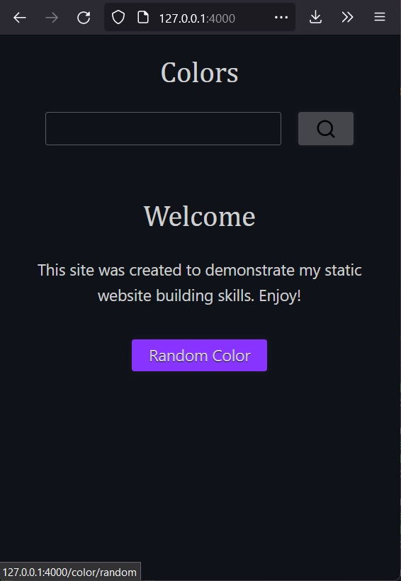

# Color code static website

A static website that provides color information for a given hex code.

## Tools:

Backend Frameworks: 
  
  - NodeJS/ExpressJS

Frontend Frameworks: 
  
  - No client-side libraries (other than feather icons)

## Screenshots

